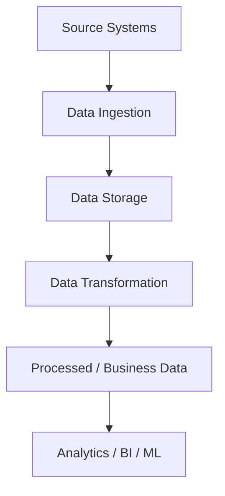
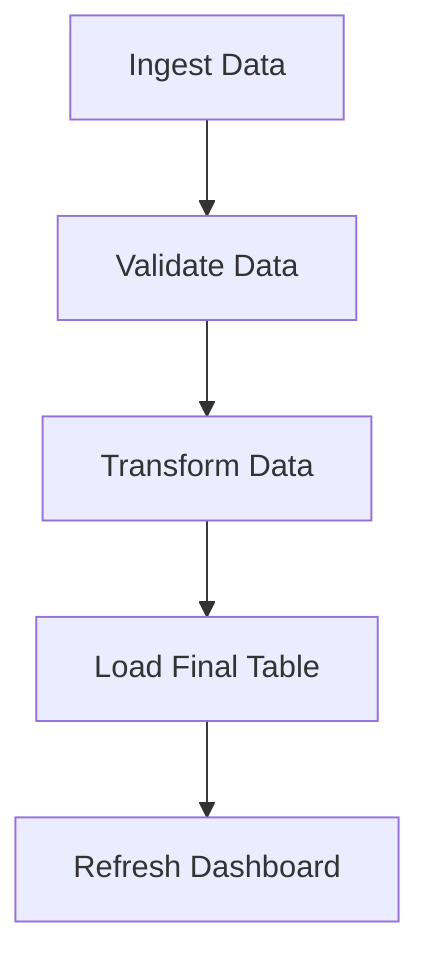
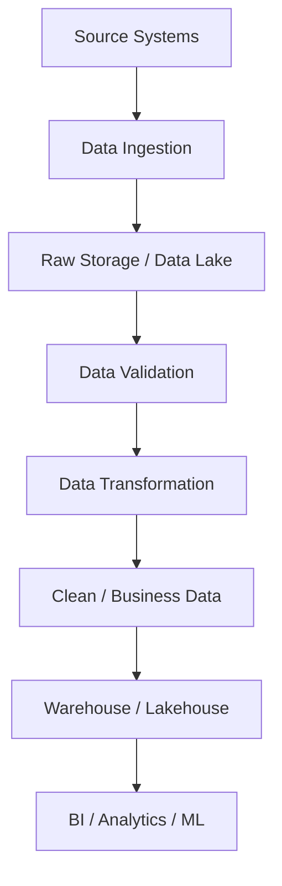

# 📘 Fundamentals of Data Engineering

This repository contains notes on the **Fundamentals of Data Engineering**, covering essential concepts, workflows, and tools used in modern data engineering.

---

## 🔹 What is Data Engineering?
Data Engineering is the process of collecting, moving, storing, transforming, and preparing data so it can be reliably used for:
- Analytics
- Business Intelligence
- Reporting
- Machine Learning
- Business decision-making

A Data Engineer builds and maintains the systems and pipelines that make this possible.

---

## 🔹 Basic Data Engineering Flow
## End-to-End Pipeline


This flow is the foundation of most Data Engineering systems. 

---

## 1- Data Sources
Common sources include:
- Application Databases
- APIs
- CSV / JSON Files
- SaaS Applications
- Logs
- Streaming Systems (e.g., Kafka, PostgreSQL, MySQL, APIs)

Key questions before designing a pipeline:
- Where is the data coming from?
- What format is it in?
- How much data is generated?
- How frequently does it change?
- How quickly does the business need it?

---

## 2- Data Ingestion
Moving data from source systems into the data platform.  

- Can be **periodic (batch)** or **continuous (streaming)** depending on business needs.
  Example:<br>
  ```mermaid
    flowchart TD
        A[PostgreSQL] --> B[Ingestion Pipeline] --> C[Cloud Storage]

The ingestion process may run periodically or continuously depending on the business 
requirement. 

---

## 3- Batch vs Streaming
These are two common ways of processing data. 
- Batch Processing
- Streaming Processing

### 🔹 Batch Processing 
- Data processed at scheduled intervals (hourly, daily, nightly).  
- Suitable for: **daily reports, historical processing, ETL pipelines.**
  <br>Example: A company processes all of yesterday's orders every morning. 

### 🔹 Streaming Processing 
- Data processed continuously or near real-time.  
- Suitable for: **fraud detection, live monitoring, real-time analytics, application events.**
  Example:<br>
  ```mermaid
  flowchart TD
      A[Payment Event] --> B[Streaming Pipeline] --> C[Fraud Detection]


**Note**<br>
Batch     → Process periodically. <br>
Streaming → Process continuously / near real time .

Not every pipeline requires streaming. The business latency requirement should determine the 
approach.

---

## 4- Full Load vs Incremental Load
Suppose a source table contains: 
100 million records but only 50,000 records change every day. Processing all 100 million records daily may be unnecessary.
- **Full Load**: Process the entire dataset (commonly used for initial loads, small datasets, complete rebuilds).<br>
    ```mermaid
    flowchart TD
        A[Read Everything] --> B[Process Everything] --> C[Load Everything]


- **Incremental Load**: Process only new or changed records (changes identified using timestamps, watermarks, CDC).  
  ✅ Faster, cheaper, scalable.
    ```mermaid
    flowchart TD
        A[New / Updated Records] --> B[Process] --> C[Update Target]


Why Incremental Processing? 
1) Faster processing 
2) Lower compute usage 
3) Reduced cost 
4) Better scalability 

---

## 5- ETL vs ELT
### 🔹 ETL (Extract → Transform → Load): 
Transform before loading into the final target system.  

### 🔹 ELT (Extract → Load → Transform): 
Load raw data first, then transform inside the target platform.  

Modern cloud warehouses often prefer **ELT**  because they provide scalable compute for transformations.

---

## 6- Data Lake vs Data Warehouse
### 🔹 Data Lake: 
Data Lake provides scalable storage for large amounts of raw and processed data. 

It can contain formats such as: 
- CSV 
- JSON 
- Parquet 
- Logs 

Examples of commonly used storage: 
- Amazon S3 
- Azure Data Lake Storage 
- Google Cloud Storage

### 🔹 Data Warehouse:
Data Warehouse is designed primarily for structured analytical data and reporting.

Use Cases:
 - BI dashboards
 - Business reports
 - Analytical queries
 - Aggregations

Examples: 
 - Snowflake
 - BigQuery
 - Amazon Redshift

**Simple Difference**<br>
Data Lake 
→ Flexible storage for raw and processed data 
Data Warehouse 
→ Structured data optimized for analytics 

---

## 7- Data Transformation
Raw source data is rarely ready for business use. So, Data Engineer performs transformations.

Transformations include:
- Removing duplicates
- Handling nulls
- Correcting data types
- Standardizing formats
- Joining datasets
- Filtering invalid records
- Aggregations & derived columns

**Example:**<br>
**Source:* <br>
 order_id <br>
 customer_id <br>
 amount <br>
 discount <br>
 status

**Business may require:* <br>
 final_amount = amount - discount 

This transformation converts source data into information useful for downstream consumers.

---

## 8- Data Quality
A successful pipeline does not automatically mean the data is correct. 
Data quality checks ensure that the data reaching downstream systems is reliable. 

Checks ensure reliability:
- Null checks
- Duplicate detection
- Negative values
- File arrival validation
- Source vs target count validation

**Poor data quality → incorrect dashboards & decisions.**

A Data Engineer is responsible not only for moving data, but also for making sure it is reliable. 

---

## 9- Data Orchestration
A pipeline normally contains multiple dependent tasks. 

**Example:**<br>


These tasks need to run in the correct sequence.

**Orchestration manages this workflow.**

It typically handles:
- Scheduling
- Dependencies
- Retries
- Failure handling
- Monitoring

**Tools**: 
- Apache Airflow
- Azure Data Factory
- Databricks Workflows

---

## 🔹 End-to-End Pipeline Example (E-commerce)
Consider an e-commerce company. 
**Sources** 
- Orders Database 
- Customer Database 
- Product API 
- Website Events 

**Pipeline** 


**Around this pipeline, we also need:** 
- Data Quality 
- Orchestration 
- Monitoring 
- Security 

This represents the basic architecture of a production Data Engineering system. 

---

## 🔹 Common Tools & Their Purpose
| Technology            | Purpose                          |
|------------------------|----------------------------------|
| SQL                   | Querying & transforming data     |
| Python                | Automation, APIs, data processing|
| Apache Spark          | Distributed data processing      |
| Databricks            | Lakehouse workloads              |
| Kafka                 | Event streaming                  |
| Airflow / ADF         | Pipeline orchestration           |
| Snowflake / BigQuery  | Analytical platforms             |
| S3 / ADLS / GCS       | Cloud storage                    |

---

## 🔹 Quick Revision
- **Data Flow**: 
Source → Ingestion → Storage → Transformation → Serving → Consumption  
- **Batch vs Streaming**: Periodic vs continuous processing  
- **Full vs Incremental**: All data vs only changed data  
- **ETL vs ELT**: Transform before loading vs Transform after loading
- **Data Lake vs Warehouse**: Flexible data storage(Raw/processed) vs structured and optimized data for analytics/reporting.
- **Data Quality**: Making sure data is complete, valid, consistent, and reliable. 
- **Orchestration**: Manage pipeline scheduling, dependencies, retries and failures.
